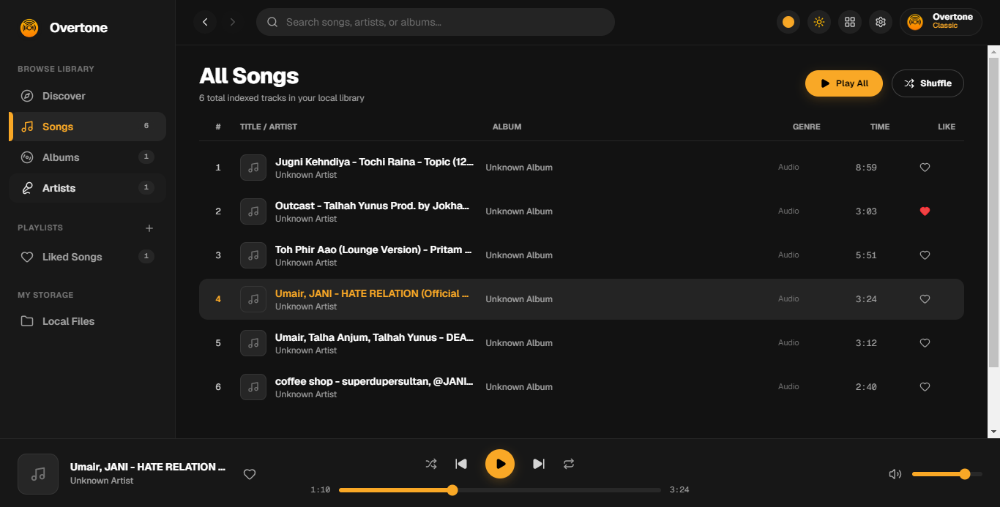
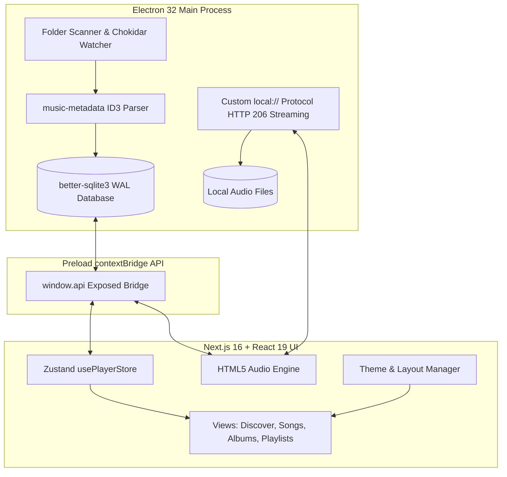

<p align="center">
  
</p>

<h1 align="center">🎵 Overtone</h1>

<p align="center">
  <strong>A modern, local-first music player with Spotify-grade design, dual themes, dual layouts, and blazing-fast offline playback.</strong>
</p>

<p align="center">
  <a href="https://github.com/gitnaseem745/overtune/releases"></a>
  <a href="LICENSE"></a>
  <a href="https://www.electronjs.org/"></a>
  <a href="https://nextjs.org/"></a>
  <a href="https://react.dev/"></a>
  <a href="https://www.sqlite.org/"></a>
  <a href="CONTRIBUTING.md"></a>
  <a href="CODE_OF_CONDUCT.md"></a>
</p>

---

## 📸 Preview

<p align="center">
  
</p>

---

## ✨ Features

### 🎛️ Dynamic Spotify-Style Miniplayer
- **Seamless Auto-Layout Switching:** Automatically transitions between **Square Card Mode** (`height >= 185px`) with ambient glow, hover playback controls, and scrubbable seekbar, and **Compact Horizontal Bar / Pill Mode** (`height < 185px`) with small thumbnail, quick actions, and discrete progress fill.
- **Floating Always-on-Top:** Floats above all other windows, browsers, and applications while working or gaming (`alwaysOnTop: true`).
- **Frameless Window & Hardware Drag:** Completely frameless window with zero OS titlebars in Miniplayer, featuring full multi-monitor `-webkit-app-region: drag` support.
- **Uninterrupted Audio Playback:** Zero latency or audio pauses when switching in and out of Miniplayer mode.

### 🎨 13-Theme Visual Architecture, Custom Scrollbars & Dynamic SVG Branding
- **☀️ Overtone Light (Default):** Clean, warm off-white interface with energetic amber accents (`#f9a826`).
- **🌙 Spotify Dark:** True deep black dark mode (`#121212` / `#181818`) with authentic Spotify Green accents (`#1db954`).
- **13 Curated & DaisyUI Themes:** Choose from Warm Amber, Spotify Green, Violet Purple, Ocean Blue, Retro, Valentine, Pastel, Halloween, Synthwave, Cyberpunk, Aqua, Cupcake, and Coffee.
- **Theme-Adaptive Custom Scrollbars:** Sleek, translucent rounded scrollbars tailored for both Dark and Light themes, eliminating default Windows white scrollbars and arrows.
- **Dynamic Theme-Aware SVG Logo:** Scalable vector brand emblem in the navbar, sidebars, and preferences modal that automatically updates its gradients with the active theme.
- **Persistent Preferences:** Theme and layout choices are stored in `localStorage` and persist seamlessly across app restarts.

### 📐 Dual Desktop Layouts & Collapsible / Hideable Navigation
- **Classic 2-Column (Default):** Minimalist layout with Left Navigation Sidebar, Center Main View, and Bottom Transport Player.
- **Spotify Pro 3-Column:**
  - **Left Panel:** Navigation + Collapsible *"Your Library"* with quick filter pills (Albums/Artists), Liked Songs shortcut, and native playlists.
  - **Icon-Only Compact Mode:** Collapse the sidebar into a sleek `w-[72px]` icon column with tooltips and active indicators.
  - **Full Hide / Show Toggle:** One-click toggle button (`<PanelLeft />`) in the top navbar to expand the main view to 100% full width.
  - **Center Panel:** Sticky translucent top bar with history navigation (Back/Forward), live instant search, and dynamic view routers.
  - **Right Panel:** Collapsible **Now Playing Showcase** (high-res cover art, track details) and an **Interactive Live Queue Drawer** with reordering and removal controls.
  - **Bottom Player:** Full transport bar with clean filled seekbar, volume control, Miniplayer toggle, and shuffle/repeat modes.

### 📁 Local-First Music Indexer & Update Persistence
- **Instant Metadata Extraction:** Powered by `music-metadata` to extract high-resolution embedded ID3 cover art, artist names, album titles, track numbers, and genres.
- **Background File Watcher:** Uses `chokidar` to detect added, modified, or deleted audio files in real time.
- **High-Performance Database:** Stores library cache in SQLite (`better-sqlite3`) in **WAL mode** for sub-millisecond querying across tens of thousands of tracks.
- **Automatic Migration Across Updates:** Seamless database migration guarantees your playlists, favorites, and library are preserved permanently when upgrading versions.
- **Taskbar Pinning Persistence:** Registered Windows AppUserModelID (`com.overtone.app`) and static NSIS upgrade GUID to keep your taskbar pin intact across updates.
- **Arbitrary Timeline Seeking:** Custom `local://` Electron streaming protocol supporting **HTTP 206 Partial Content Range** headers for instant, gapless scrubbing.

### 🎶 Playlists & Favorites System
- **Native Playlist CRUD:** Create, rename, delete, and manage playlists directly in the app.
- **Context Menus:** Add any song to playlists, play next, or append to queue via the `...` track menu.
- **M3U Import & Export:** Export playlists as standard Extended `.m3u` files or import existing `.m3u`/`.m3u8` files.
- **Liked Songs:** Persistent SQLite-backed favorites with dedicated Spotify-style purple gradient hero view.

---

## 🎼 Supported Audio Formats

| Format | Extension | Embedded Artwork | Gapless Seeking |
|---|---|:---:|:---:|
| **MP3** | `.mp3` | ✅ ID3v1 / ID3v2 | ✅ HTTP 206 Streaming |
| **FLAC** | `.flac` | ✅ Vorbis Comments | ✅ HTTP 206 Streaming |
| **WAV** | `.wav` | ✅ RIFF Info | ✅ HTTP 206 Streaming |
| **M4A / AAC** | `.m4a`, `.aac` | ✅ MP4 Atoms | ✅ HTTP 206 Streaming |
| **OGG** | `.ogg` | ✅ Vorbis | ✅ HTTP 206 Streaming |

---

## 🏗️ Architecture & Data Flow



---

## 🛠️ Tech Stack

| Layer | Technology | Description |
|---|---|---|
| **Desktop Runtime** | [Electron 32](https://www.electronjs.org/) | Cross-platform desktop shell with secure IPC |
| **Frontend Framework** | [Next.js 16](https://nextjs.org/) & [React 19](https://react.dev/) | React frontend exported as static local bundle |
| **State Management** | [Zustand 5](https://github.com/pmndrs/zustand) | Lightweight, reactive centralized state store |
| **Styling & Icons** | [Tailwind CSS 4](https://tailwindcss.com/) & [Lucide](https://lucide.dev/) | Utility-first responsive design & crisp iconography |
| **Database** | [better-sqlite3](https://github.com/WiseLibs/better-sqlite3) | Synchronous, ultra-fast local SQLite storage in WAL mode |
| **Audio Metadata** | [music-metadata](https://github.com/Borewit/music-metadata) | High-resolution ID3, Vorbis, and MP4 tag extraction |
| **Directory Watching**| [chokidar 3](https://github.com/paulmillr/chokidar) | Incremental filesystem change monitoring |
| **Packaging** | [electron-builder](https://www.electron.build/) | NSIS Windows installer generation & bundling |

---

## 📂 Project Structure

```
overtune/
├── .github/                    # GitHub CI/CD workflows and issue/PR templates
│   ├── workflows/              # GitHub Actions (CI & automated release builder)
│   ├── ISSUE_TEMPLATE/         # Bug report & feature request issue forms
│   └── PULL_REQUEST_TEMPLATE.md# Pull request checklist
│
├── main/                       # Electron Main Process
│   ├── db.ts                   # SQLite schema, queries, favorites, playlist CRUD & M3U
│   ├── scanner.ts              # ID3 scanner, folder watcher & artwork cache
│   ├── preload.ts              # Secure IPC ContextBridge API
│   └── main.ts                 # Window management, custom protocol & IPC handlers
│
├── src/                        # Next.js Frontend
│   ├── app/
│   │   ├── layout.tsx          # Root Next.js layout & metadata
│   │   └── page.tsx            # Master orchestrator for layouts & views
│   ├── components/             # Modular UI Components
│   │   ├── AudioEngine.tsx     # Headless HTML5 audio engine synced with Zustand
│   │   ├── TopHeader.tsx       # Search bar, history navigation & quick toggles
│   │   ├── Sidebar.tsx         # Dual-mode sidebar (Classic & Spotify 3-column)
│   │   ├── RightPanel.tsx      # Spotify right drawer (Now Playing + Live Queue)
│   │   ├── NowPlayingBar.tsx   # Persistent bottom transport player
│   │   ├── SettingsModal.tsx   # Visual theme & layout preferences dialog
│   │   ├── CreatePlaylistModal.tsx # Playlist creator & M3U file importer
│   │   ├── TrackRow.tsx        # Song item with animated equalizer & context menu
│   │   ├── DiscoverView.tsx    # Home view with featured albums & top tracks
│   │   ├── SongsView.tsx       # All songs table with Play All / Shuffle
│   │   ├── AlbumsView.tsx      # Albums grid
│   │   ├── ArtistsView.tsx     # Artists grid
│   │   ├── DetailView.tsx      # Album & Artist detail pages with hero banner
│   │   ├── PlaylistDetailView.tsx # Playlist detail page with rename & export
│   │   ├── LikedSongsView.tsx  # Liked songs view with purple gradient banner
│   │   └── LocalFilesView.tsx  # Music folder importer & indexing stats
│   ├── store/
│   │   └── usePlayerStore.ts   # Zustand central store for playback & UI state
│   ├── types/
│   │   ├── music.ts            # TypeScript interfaces & enums
│   │   └── global.d.ts         # Window.api IPC type definitions
│   └── lib/
│       └── utils.ts            # Helper functions (time formatting, local:// URLs)
│
├── scripts/
│   ├── build-installer.js      # Automated 6-step .exe installer build pipeline
│   └── generate-icons.js       # Multi-resolution ICO and asset generator
├── release/                    # Output directory for packaged .exe installers
└── build-installer.bat         # 1-Click Windows batch runner
```

---

## 🚀 Getting Started

### Prerequisites
- **Node.js**: `v20.x` or higher
- **npm**: `v10.x` or higher
- **Windows / macOS / Linux** (Windows recommended for `.exe` NSIS installer)

### 1. Installation
Clone the repository and install dependencies:
```bash
git clone https://github.com/gitnaseem745/overtune.git
cd overtune
npm install
```

### 2. Running in Development Mode
Launch Next.js dev server and Electron concurrently:
```bash
npm run dev
```

### 3. Running Linters & Type Checking
```bash
npm run lint
npm run typecheck
```

---

## 📦 Building the `.EXE` Installer

Overtone includes an automated build pipeline that handles Next.js static compilation, Electron bundling, native module rebuilding, and NSIS setup creation:

### Option A: Via NPM Script
```bash
npm run build:installer
```

### Option B: 1-Click Windows Batch Script
Double-click `build-installer.bat` in the root folder, or run:
```cmd
build-installer.bat
```

The generated installer will be placed in the `release/` directory:
- `release/Overtone-Setup-0.1.3.exe`

---

## 🤝 Contributing

Contributions are what make the open source community such an amazing place to learn, inspire, and create. Any contributions you make are **greatly appreciated**.

Please see [CONTRIBUTING.md](CONTRIBUTING.md) for detailed instructions on getting started, coding guidelines, and submitting pull requests.

Please also read our [Code of Conduct](CODE_OF_CONDUCT.md).

---

## 🔒 Security

For security vulnerabilities and responsible disclosure guidelines, please refer to our [Security Policy](SECURITY.md).

---

## 👨‍💻 Author

**Naseem Ansari**
- GitHub: [@gitnaseem745](https://github.com/gitnaseem745)
- Repository: [gitnaseem745/overtune](https://github.com/gitnaseem745/overtune)

---

## 📄 License

This project is open-sourced under the [MIT License](LICENSE).
